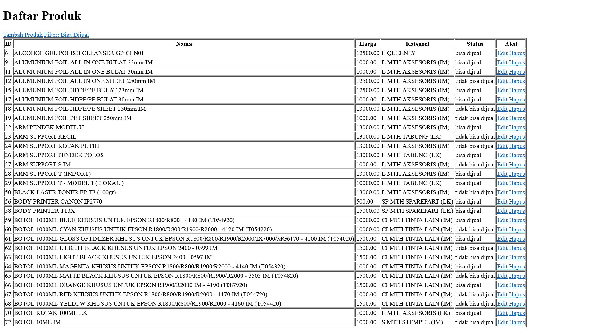
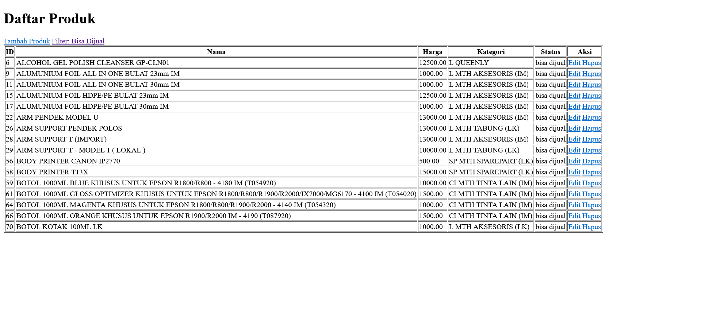

# Tes Junior Programmer Fastprint
### Requirement Source: 
- https://recruitment.fastprint.co.id/tes/programmer

# Instalasi
### 1. Clone
``` bash
git clone https://github.com/An-Ace/fastprint-test
cd fastprint-test
```
### 2. Buat Virtual Environment
``` bash
# Dengan venv
python -m venv venv
source venv/bin/activate   # Linux/Mac
venv\Scripts\activate      # Windows

# Dengan pipenv (opsional)
pip install pipenv
pipenv shell
```
### 3. Install Dependensi
``` bash
pip install -r requirements.txt
``` 
### 4. Migrasi Database
``` bash
docker compose up -d
# Atau sesuaikan DB_NAME, DB_USERNAME, DB_PASSWORD dengan compose.yaml (Bila tidak ada Docker).
python manage.py migrate
```
### 5. Jalankan Aplikasi & Seeder
``` bash
python manage.py runserver
```
- Buka http://localhost:8000/import-data/ -> Untuk Seeder
- Buka http://localhost:8000/ -> Untuk Halaman Utama Dimana ada CRUD untuk data Produk


### Stacks:
- Python@3.13.1
- Django
- PostgreSQL [Can Use Docker Container]

### Fitur
- CRUD Produk

## Tabel
### Produk
---
id_produk | nama_produk | harga | kategori_id | status_id
---
### Kategori
---
id_kategori | nama_kategori
---
### Status
---
id_status | nama_status
---

# Gambaran/Dokumentasi:
### Halaman Utama

### Halaman Filter *Bisa Dijual

### Halaman Tambah Produk

### Halaman Edit Produk

### Halaman Konfirmasi Hapus Produk
